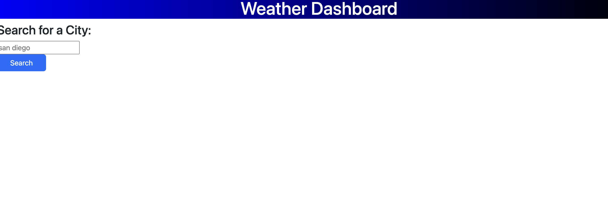
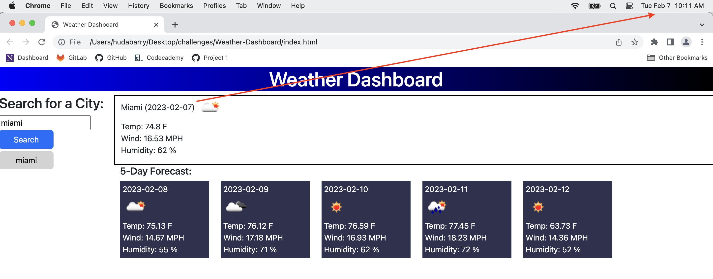

# Weather-Dashboard

## Description

- This is the sixth challenge.
- The purpose of this repository is for a traveler to see the weather outlook for multiple cities.

## Usage

[Click here](https://hbarry89.github.io/Weather-Dashboard/) to navigate to the live link of this repository.

---------------------------

- User is presented with a blank page that has a search engine for weather:

---------------------------

- User inputs a city name, then user is presented with current day weather (that matches the current date) along with forecast for the next 5 days:

---------------------------

- The citities that the user inputed are stored as a search history,
- When a city from the search history is clicked, it will display information for that city:

---------------------------

## Credit

### Resources :books:
- Bootcamp Materials
- Fetch code from Bootcamp Materials: Activities
- W3 Schools
- Tutor and AskBCS Learning Assistants
- [How to Use API Keys](https://coding-boot-camp.github.io/full-stack/apis/how-to-use-api-keys)

### Assets :gear:
- [Bootstrap](https://getbootstrap.com/)
- [OpenWeather](https://openweathermap.org/) API

### Applications Used :sparkles:
- VS Code

Thank you for visiting! :hibiscus:
